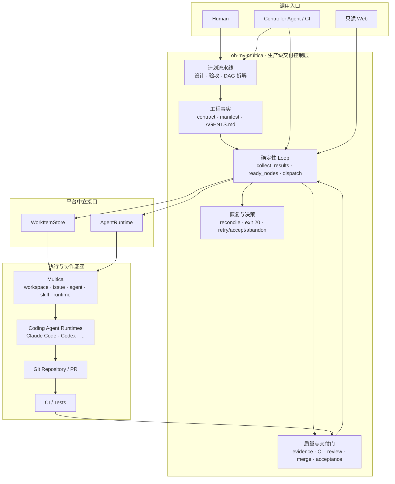
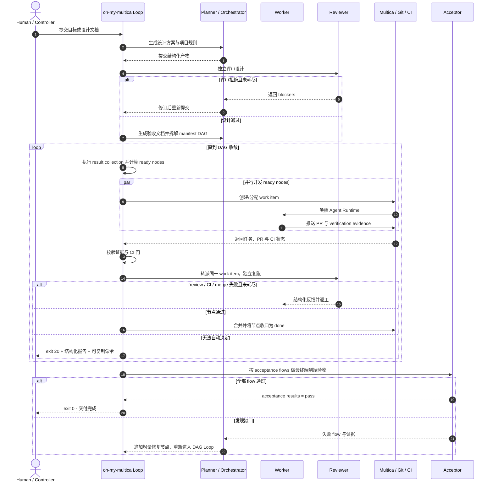

# oh-my-multica

[](https://github.com/xiaohei-info/oh-my-multica/actions/workflows/ci.yml)
[](https://github.com/xiaohei-info/oh-my-multica)
[](./LICENSE)

[English](README.md) | [简体中文](README.zh-CN.md)

**构建在 [Multica](https://github.com/multica-ai/multica) 之上的生产级 AI 软件交付系统。**

[Multica](https://github.com/multica-ai/multica) 把 Claude Code、Codex 等 Coding Agent 统一接入
工作空间、issue、任务队列和本地 runtime。Agent 可以像团队成员一样接受任务、报告进度和阻塞，
团队也可以统一管理运行机器与可复用 Skill。它为多 Agent 协作解决了任务分配、生命周期、运行时
调度和状态追踪等基础问题。

Multica 更多关注的是 Agent 的执行与协作，但不会替软件项目定义完整的工程交付过程，例如需求怎样进入设计、
如何形成可执行验收标准、多个开发任务如何按依赖并行、什么证据足以证明实现正确、谁来独立评审，
以及何时允许合并和如何从失败中恢复。

oh-my-multica 基于 Multica 优秀的机制设计，在其之上实现了更加完整的软件工程交付控制层，
把一个需求推进为经过设计、开发、验证、评审、合并和最终验收的软件变更。

**Multica 作为一套完整的 Agent Runtime 任务平台管理 Agent 如何工作，
而 oh-my-multica 在其之上管理软件如何完成交付。**

oh-my-multica 要解决的核心问题是：**如何让多个 Coding Agent 在尽量少的人工介入下，
把一个需求完整地设计、实现并交付为生产级软件系统，而不是停留在代码生成、原型或 Demo，并很认真的告诉你已经完成所有功能可以交付。**

> **oh-my-multica 把生产级复杂软件交付的组织门槛降到最低。** 当目标和验收标准明确后，
> 设计、拆解、开发、验证、评审和验收都可以交给可扩展的 Agent Team。影响交付吞吐量的主要资源
> 变成两项：机器数量决定 Agent 的开发并发度，Token 预算决定可以投入多少推理、实现、复测和返工。

## 为什么需要 oh-my-multica

Coding Agent 已经很会写代码。困难通常出现在代码之外：需求在长对话中逐渐漂移，多个 Agent
修改了相互冲突的部分，测试结果只存在于一段自述中，评审者相信作者的总结，或者一个运行数小时
的循环悄悄停止，却没有留下可继续执行的状态。

增加 Agent 数量不会自动解决这些问题。生产级交付需要一个独立于 LLM 的控制系统，负责保存事实、
约束边界、验证结果、推进状态，并在无法自动判断时把决定交还给人。

### 与多 Agent 协作开发产品有什么不同

| 方案 | 协作方式 | 主要解决的问题 | 应用场景 |
|---|---|---|---|
| 单个 Coding Agent | 一个 Agent 在单次会话或工作区中完成任务 | 提高单项编码任务的完成速度 | 小型 Bug、局部重构、脚本、原型和边界清晰的功能修改 |
| [Codex App](https://openai.com/index/introducing-the-codex-app/) / [Claude Code Agent Teams](https://code.claude.com/docs/en/agent-teams) | 人类或 lead Agent 协调多个独立 session、thread 或 worktree | 并行开发、上下文隔离和交互式任务分工 | 任务已经拆清楚，开发者愿意持续监督、协调和整合多个 Agent 的结果 |
| [Factory Missions](https://docs.factory.ai/features/missions/overview) / [OpenAI Symphony](https://openai.com/index/open-source-codex-orchestration-symphony/) | 以 Mission 或 issue tracker 为控制面，持续向 Coding Agent 分配任务 | 长时间运行、批量任务编排和持续推进 backlog | 需求已经进入任务系统，仓库已有成熟 harness，适合处理大量相对独立的开发任务 |
| [MetaGPT / MGX](https://github.com/FoundationAgents/MetaGPT) | 产品经理、架构师、工程师等角色按照 SOP 协作生成软件 | 把自然语言需求转换为用户故事、设计、文档和代码 | 绿地项目、快速原型，以及从零生成一套结构化软件产物 |
| **oh-my-multica** | 基于 contract 的 manifest DAG 协调 planner、orchestrator、worker、reviewer 和 acceptor | **在尽量少的人工介入下完成设计、开发、验证、评审、合并和最终验收** | **复杂功能、多模块系统和生产级软件服务；要求过程可验证、可恢复，并能明确判断是否真正完成** |

选择标准很直接：如果目标只是让 Agent 更快地写代码或并行处理任务，前面的方案已经足够；如果目标是
在减少人工接力的同时，把需求推进为经过完整工程过程和最终验收的生产级软件交付，oh-my-multica
提供的是一套可以直接执行的交付控制协议。

## 适合谁

- 已经重度使用 AI Coding，希望从亲自盯住每一次对话，转向管理目标、约束和结果的开发者。
- 希望用尽量少的人工接力，持续产出可部署、可维护软件服务的个人、创业团队和工程团队。
- 编程经验有限，但愿意把目标和验收结果说清楚，希望 Agent 按完整架构设计与实施流程完成项目的人。
- 需要同时使用多个 Agent 或多台运行机器，又不希望任务状态散落在终端、聊天记录和个人记忆中的团队。

oh-my-multica 不适合一次性的代码片段生成，也不会替代业务决策。它最有价值的场景，是任务足够复杂、
交付质量值得被明确验证，并且你希望把重复监督交给系统。

## 如何开始

### For Human

人类只需要关注三件事：配置可用的 Agent 团队、描述目标、处理系统无法替你决定的问题。

```bash
omac init
omac plan create --name <feature> --goal "<你希望交付的结果>"
```

`plan create` 会推进设计方案、验收文档和 manifest DAG。流程完成后，直接执行输出中给出的
“下一步”命令，让确定性 Loop 接管开发与交付。你可以通过平台 issue 或 `omac web` 查看进度；
只有命令返回 exit 20 时，才需要根据结构化报告选择重试、接受或放弃。

### For Agent

Agent 收到标题带 `[DAG:...]` 的任务后，唯一固定入口是：

```bash
omac work show <issue-id> --output json
```

然后按返回结果工作：

1. 以 `task`、`context`、`contract` 和 `authority` 为当前任务事实。
2. 只加载 `guide_refs` 列出的最小知识，不预读整套协议。
3. 完成后执行返回结果中的精确 `submit` 命令，不猜参数，不手动推进 issue 状态。

具体命令合同属于执行协议，不在 README 重复维护。需要时运行 `omac <command> --help` 或
对应的 `omac guide ...`。

## Agent Team 配置最佳实践

oh-my-multica 在 [`src/omac/agents/`](./src/omac/agents) 中提供了 planner、orchestrator、worker、
reviewer、acceptor，以及 architect、backend、frontend、pm 等内置模板。你可以直接使用这些模板，
也可以借鉴其中的 Instructions、职责边界和 Skill 配置来组建自己的 Agent Team。

不需要给所有角色都使用最昂贵的模型。更合理的做法是按照决策影响、任务风险和 Token 消耗分配模型：

| 任务类型 | 典型角色 | 推荐模型 | 配置理由 |
|---|---|---|---|
| 设计与规划 | planner、architect、orchestrator | GPT、Claude 的旗舰模型，或性能相当的其他第一梯队模型 | 调用次数相对少，但设计和拆解错误会被所有下游任务放大 |
| 评审与验收 | reviewer、acceptor | GPT、Claude 的次级旗舰模型，或性能相当的其他第二梯队模型 | 保持独立判断和评审质量，同时控制复跑与验收成本 |
| 开发与测试 | worker、backend、frontend 等执行角色 | 高性价比商业模型、成熟开源模型或其他第三梯队模型 | 任务数量、并发度和 Token 消耗最大，清晰 contract 与验证门可以约束执行结果 |

推荐从 1 个 planner、1 个 orchestrator、多个 worker、1 至 2 个 reviewer 和 1 个 acceptor 开始配置。
Worker 与 Reviewer 应尽量使用不同 Agent，避免产出者自我评审。安全、交易、权限、数据迁移、核心架构
等高风险节点可以临时升级到更强模型。先把 contract、验证命令和质量门配置稳定，再通过增加运行机器、
worker 数量和 Token 预算扩大并发；否则只是让错误更快地产生。

## 核心设计：Loop Engineering × Harness Engineering

oh-my-multica 的设计建立在两个互补的工程方向上。

### Loop Engineering：让程序驱动 Agent

传统 Agent 工作流通常由人不断读取输出、补充提示词、决定下一步。oh-my-multica 把这部分改成确定性程序：

```text
result collection（`collect_results`）→ 校验证据 → 同步状态 → 计算 ready nodes → 派发任务 → 判断是否收敛
```

LLM 只承担需要推理的有限任务，例如设计、拆解、编码、评审和验收。长期运行、重入、并行调度、
失败收口和停止条件由 CLI 负责。Loop 不靠某个 Agent “记得继续”，也不会因为上下文重置而失忆。

### Harness Engineering：把工程判断编码进环境

仅有循环还不够。一个错误目标可以被循环执行得又快又稳定。Harness Engineering 关注模型之外的
整个工作环境：知识如何提供、架构如何约束、结果如何验证、错误如何反馈、状态如何保存。

oh-my-multica 把这些约束落成版本化、可检查的工程资产：

- 设计文档记录核心数据、模块边界、跨模块契约、风险和兼容性。
- 验收文档把目标变成用户视角、端到端、可执行的 flow。
- manifest 为每个节点声明 owner、依赖、contract、验证命令和集成门。
- `AGENTS.md` 保存经过设计确认、长期约束整个仓库的项目规则。
- worker、reviewer 和 acceptor 提交结构化证据，而不是一句“已经完成”。
- `guide_refs` 按任务逐步披露知识，避免一份巨型提示词挤占上下文。

这一思路与 [OpenAI 的 Harness Engineering 实践](https://openai.com/index/harness-engineering/)、
[Martin Fowler 网站上的 Harness Engineering 讨论](https://martinfowler.com/articles/harness-engineering.html)
以及 [Loop Engineering 的近期实践总结](https://addyosmani.com/blog/loop-engineering/)方向一致，
但 oh-my-multica 将它们落实为围绕生产软件交付的 CLI 协议、状态机和证据模型。

## oh-my-multica 在 Multica 之上增加了什么

| 机制             | oh-my-multica 的做法                                                         | 解决的问题                           |
| ---------------- | ---------------------------------------------------------------------------- | ------------------------------------ |
| 确定性控制反转   | CLI 持有主循环，Agent 是有终点的单次执行者                                   | 防止监督 Agent 跑偏、遗忘或提前退出  |
| 契约化计划流水线 | 设计方案 → 验收文档 → manifest DAG，阶段之间有 machine gate 和 review gate | 防止需求、设计、拆解和实现各说各话   |
| 可验证 DAG       | 每个节点都有依赖、owner、reviewer、acceptance、验证命令和集成门              | 让并行建立在边界上，而不是碰运气     |
| 独立质量裁决     | worker 不自审自放行；reviewer 独立复跑；acceptor 按 flow 做最终验收          | 避免把作者自述当成事实               |
| 结构化证据       | verification、review report、acceptance results 都有 schema 和提交门         | 让“通过”可以被程序检查和后续追溯   |
| 交付收口         | 可配置 CI、PR 合并和总控验收；失败回到有界返工                               | 避免把“代码写完”误认为“已经交付” |
| 持久化与恢复     | 状态保存在 manifest 与平台；重跑先 reconcile；失败返回 exit 20               | 中断后继续，而不是重新提示一遍       |
| 平台适配边界     | pipeline 只依赖`WorkItemStore` 与 `AgentRuntime`                         | 后续接入其他任务平台时不改交付流程   |

## 整体架构

oh-my-multica 不替代 Multica，也不替代 Coding Agent。它位于调用者与执行平台之间，负责把软件工程事实
转换成可执行状态，再通过统一接口使用 Multica 的任务与运行时能力。



可编辑源文件：[整体架构图](docs/diagrams/omac-architecture.drawio)。

### 架构边界

- pipeline 与 CLI 只能调用 `WorkItemStore` 和 `AgentRuntime`，不能直接执行平台 CLI。
- Multica、GitHub 及未来其他平台的差异封装在 engine adapter 内。
- Web 层只解析参数、调用同一 command function，并原样返回 JSON；Human、Agent 和 Web
  看到的是同一套事实。

## 从需求到交付

下面的泳道展示标准路径。设计、验收、拆解和开发都可以发生有界返工；系统只有在证据满足合同后
才推进状态。无法自动处理的失败不会被吞掉，而是以 exit 20 和下一步命令交还调用者。



可编辑源文件：[执行泳道图](docs/diagrams/omac-execution-flow.drawio)。

## “面向生产级”具体意味着什么

oh-my-multica 不承诺任何 Agent 生成的代码天然可以上线。生产质量取决于需求是否正确、合同是否完整、
验证命令是否有效、CI 是否配置，以及 reviewer 和 acceptor 是否具备足够能力。

oh-my-multica 提供的保证更务实：这些关键条件会成为流程中的显式事实和检查点，而不是藏在人脑或聊天记录里。

| 生产交付要求           | oh-my-multica 中的落点                                                 |
| ---------------------- | ---------------------------------------------------------------------- |
| 需求不漂移             | design problem / non-goals / flows 与 acceptance flow id               |
| 架构可维护             | 核心数据所有权、模块边界、跨模块契约、项目级`AGENTS.md`              |
| 改动不破坏既有行为     | contract 的 source of truth、non-goals、integration gates 与兼容性要求 |
| 结果可以复现           | verification commands、env setup、结构化 evidence                      |
| 作者不能自证正确       | worker 与 reviewer 分离，最终由 acceptor 按用户旅程验收                |
| 代码真正进入交付链     | PR、CI、merge 与 final acceptance 可纳入完成条件                       |
| 长任务可以中断续跑     | manifest / work item 持久化、幂等 tick、reconcile                      |
| 自动化不能越权替人决定 | 有界返工；超出边界统一 exit 20                                         |

## 安装

前置条件：

- Python 3.10 或更高版本。
- 使用 `pipx` 隔离安装 oh-my-multica 的 `omac` CLI。
- 使用 Multica engine 时，[安装 Multica CLI](https://github.com/multica-ai/multica/blob/main/CLI_INSTALL.md)
  并完成 `multica login`。

```bash
git clone https://github.com/xiaohei-info/oh-my-multica.git
cd oh-my-multica
pipx install .

omac --version
```

仓库内置 mock engine，不依赖外部平台，适合本地验证、CI 和首次试跑。

## 文档入口

- `omac guide workflow`：从计划到交付的稳定工作流。
- `omac guide role <name>`：planner、orchestrator、worker、reviewer、acceptor 的职责边界。
- `omac guide artifact <name>`：design、acceptance、manifest、evidence 的产物合同。
- `omac guide recovery`：exit 20 后的恢复协议。
- `omac <command> --help`：当前版本的命令合同与完整参数。
- [CHANGELOG.md](./CHANGELOG.md)：用户可见的版本变化。

README 负责解释项目是什么、为什么存在以及如何开始。执行中的精确事实永远以
`omac work show`、Guide 和命令帮助为准。

## 开发与验证

```bash
pip install -e .
pip install pytest
python3 -m pytest tests/
```

`live` 测试需要已经登录的 Multica 环境。项目变更只有在代码、测试和必要文档同时完成，且完整
测试通过后才算交付。

## 参与贡献

欢迎通过 issue 讨论问题和设计，通过 Pull Request 提交改进。涉及行为变化的提交需要同时提供
回归测试，并保持退出码、术语、engine 接口和 Web 数据边界向后兼容。提交前请运行完整测试。

## License

[MIT](./LICENSE)
