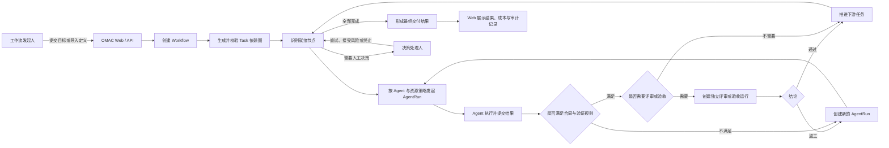
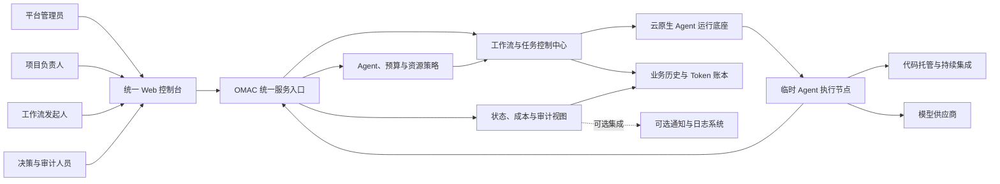
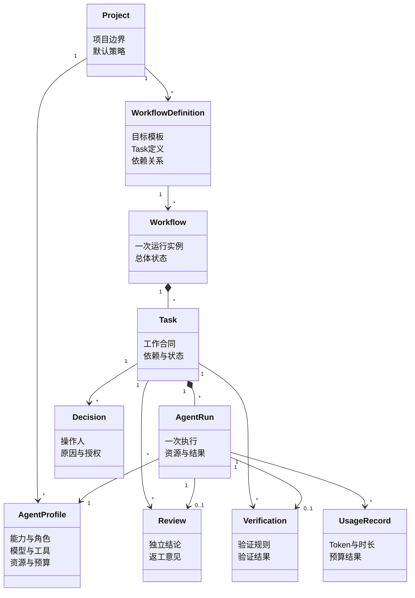
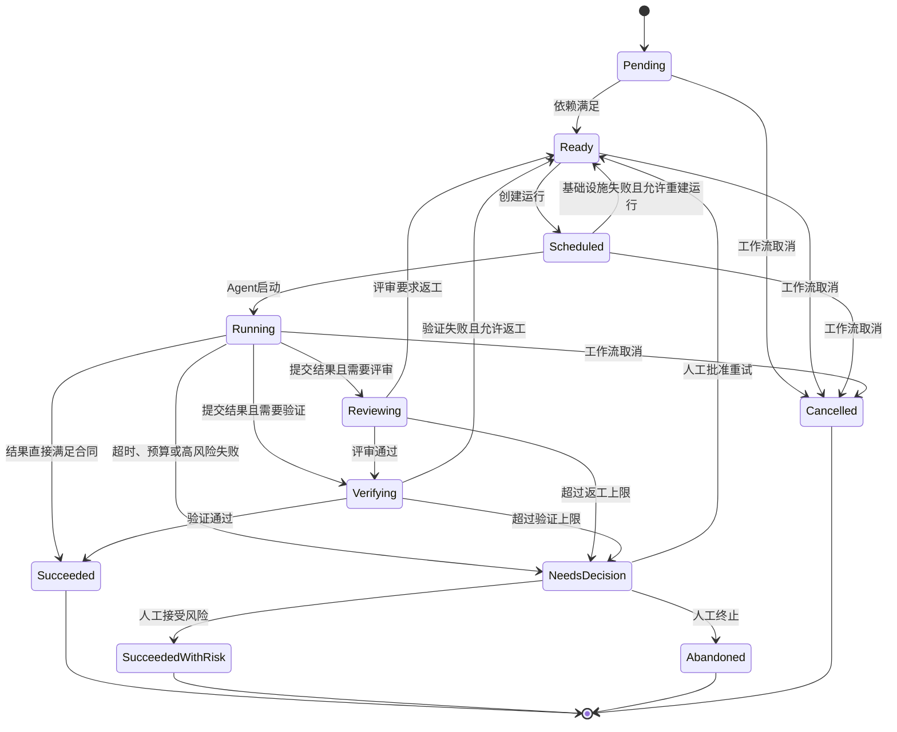
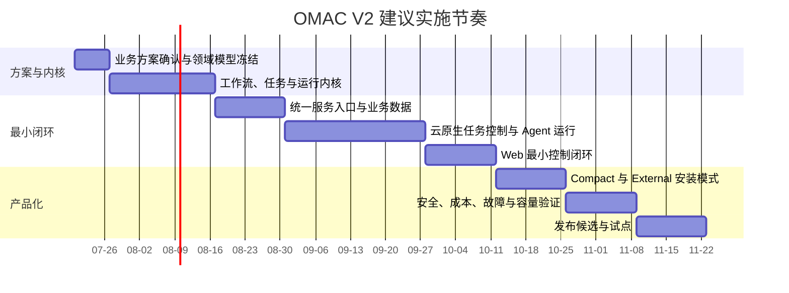

# OMAC V2 云原生 Agent Cluster 业务解决方案设计

> 文档状态：评审初稿
>
> 文档日期：2026-07-13
>
> 方案范围：OMAC V2 独立产品体系
>
> 目标读者：产品负责人、架构负责人、研发负责人、平台运维负责人

---

## 1. 已确认决策摘要

本方案建立在以下已经确认的产品决策之上。

1. OMAC V2 不再依赖 Multica 或其他 Issue 系统完成任务分发、Agent 唤醒、状态流转和结果交接。
2. OMAC V2 是一个完整的云原生 Agent Cluster，而不是运行在单机上的 CLI 编排工具。
3. OMAC 的 Web、API、控制器、数据库和 Agent 执行任务统一运行在 Kubernetes 体系中。
4. 产品同时支持两种交付模式：
   - 内置轻量集群：面向单机和少量节点，采用 K3s。
   - 外部集群接入：面向已有基础设施，接入标准 Kubernetes。
5. 两种模式使用相同的产品镜像、领域模型、资源定义和安装包能力，不维护两套产品实现。
6. 用户只通过 OMAC Web、API 和 CLI 使用产品，不需要进入外部 Issue 平台查看任务或操作状态。
7. Manifest 不再承担运行时状态存储，只作为工作流定义的导入、导出和版本化格式。
8. 工作流、任务和执行记录成为集群内的正式资源，由统一 API 管理，并通过明确的资源所有权处理并发。
9. 产品首版只支持单组织，不引入多租户计费、组织隔离和跨组织协作模型。
10. 产品不强制安装对象存储。运行状态和结构化业务数据分别进入集群资源与业务数据库，代码进入代码托管平台，长期日志能力作为可选集成。
11. OMAC V2 不兼容 OMAC V1：
    - 不保留 Multica 兼容层。
    - 不支持旧 Manifest 运行状态迁移。
    - 不保持旧 CLI、API 和配置文件的兼容。
    - 不设计 V1/V2 双写、双读或原地升级链路。
    - V1 文档和代码只作为历史参考，不约束 V2 领域模型。

---

## 2. 背景

OMAC 的业务目标是将复杂的软件研发任务拆解为可验证、可并行、可恢复的 Agent 协作流程，使 Agent 能够承担规划、拆解、开发、评审、验证和验收等具有明确终点的工作。

现有体系已经验证了以下业务方法有效：

- 确定性程序负责流程推进，Agent 只承担需要推理的工作。
- 使用任务依赖图表达复杂研发工作的先后关系。
- 使用合同、证据、评审和最终验收控制任务质量。
- 失败和异常需要显式决策，不能无限自动消耗 Token。

但现有产品将任务承载、状态管理、成员分配和 Agent 唤醒建立在外部 Issue 平台之上。OMAC 无法独立掌握完整运行状态，也无法根据机器资源、Token 预算和集群负载统一调度。

OMAC V2 将上述已验证的业务方法从外部平台中剥离，形成 OMAC 自己的产品内核，并借助云原生基础设施完成资源调度、弹性执行和故障恢复。

---

## 3. 现状问题

### 3.1 产品控制权不完整

任务是否被接收、何时启动、由哪个 Agent 执行，以及任务如何交接，依赖外部平台规则。OMAC 只能间接观察和推动任务，无法形成自己的控制闭环。

### 3.2 用户体验被外部系统割裂

用户需要在 OMAC、终端、Issue 页面和代码托管平台之间切换，无法在一个产品界面中看到工作流、任务、Agent、资源、成本、异常和最终结果。

### 3.3 状态事实源不唯一

工作流定义、运行状态、外部 Issue 状态和本地文件可能同时表达同一任务，容易产生状态漂移、并发覆盖和恢复歧义。

### 3.4 扩展能力受单机和外部平台限制

现有流程无法自然利用多节点资源，也不能根据 CPU、内存、GPU、Agent 类型和节点负载进行统一调度。增加机器并不等于增加可用 Agent 并发。

### 3.5 领域模型被 Issue 语义限制

任务被表达为一条会被反复分配、评论和修改状态的 Issue。一次任务的多次执行、评审、返工和验收没有独立、不可变的运行记录，不利于审计、成本分析和故障恢复。

---

## 4. 核心判断

### 【核心判断】

✅ 值得做：OMAC 已经验证了 Agent 协作方法，但要成为可独立交付和横向扩展的产品，必须掌握任务状态、Agent 生命周期和资源调度的完整控制权。

### 【关键洞察】

- 数据结构：Task 是长期存在的业务节点，AgentRun 是一次不可变执行；二者不能继续合并为一条 Issue。
- 复杂度：建立 OMAC 自己的状态模型后，可以同时删除任务转派、Issue 评论协议、Manifest 运行时双写和外部状态同步。
- 风险点：最大的风险不是 Kubernetes 本身，而是在重构中继续保留旧模型，最终形成新旧状态双轨。V2 不兼容 V1 是降低该风险的关键决策。

### 【技术方案原则】

1. 第一步简化并重建领域数据结构。
2. 让正常执行、评审、返工和重试都使用统一的 Task 与 AgentRun 模型。
3. 使用单一控制平面管理任务期望状态和运行状态。
4. 通过云原生资源调度执行 Agent，不自行实现机器调度器。
5. 不引入兼容层、双写链路和无明确收益的存储组件。

---

## 5. 业务目标

### 5.1 产品目标

OMAC V2 交付后，用户安装或连接集群即可获得一个完整的 Agent Cluster：

- 在 Web 中创建项目、定义工作流、配置 Agent 和发起任务。
- 系统自动拆分和调度可执行任务。
- Agent 根据集群资源和策略在合适节点运行。
- 用户在一个控制台中查看全过程状态、评审、验证、Token 消耗和异常。
- 控制组件重启或工作节点故障后，系统能够自动恢复未完成流程。
- 增加集群机器和可用 Token 配额后，系统执行容量可以相应扩展。

“瓶颈只剩机器和 Token”作为产品方向成立，但不能被解释为绝对承诺。模型供应商限流、代码托管平台、网络质量、数据库容量和错误的资源配置仍可能成为外部约束。V2 的目标是消除 OMAC 自身的单机编排和外部 Issue 引擎瓶颈。

### 5.2 建议成功指标

| 指标 | 目标 |
|---|---|
| 外部任务引擎依赖 | 任务分发和状态流转不依赖任何外部 Issue 系统 |
| 开箱即用 | 支持环境中，单机模式从安装开始到 Web 可用不超过 15 分钟 |
| 首次运行 | 安装完成后，用户可在 30 分钟内完成首个示例工作流 |
| 状态可见性 | 所有 Workflow、Task、AgentRun、评审、验证和决策均可在 OMAC Web 查询 |
| 故障恢复 | 控制组件重启不丢失任务，未完成工作可自动继续收敛 |
| 调度扩展 | Agent 任务不存在固定单机绑定，容量随集群可调度资源增加 |
| 成本治理 | 每次 AgentRun 均记录模型、Token、时长和预算结果 |
| 状态一致性 | 重复事件和重复提交不得产生重复结算或互相矛盾的终态 |

---

## 6. 范围与非目标

### 6.1 本期范围

- 单组织下的项目、用户和权限管理。
- 工作流定义、任务依赖、Agent 配置和执行策略。
- Agent 任务调度、运行、停止、超时和结果提交。
- 规划、拆解、开发、评审、验证、验收和人工决策闭环。
- Web 控制台、统一 API 和 CLI。
- 单机或少量节点 K3s 安装。
- 外部 Kubernetes 集群安装。
- 运行状态、历史记录、Token 账本和审计。
- Git、模型供应商和通知系统的外部集成边界。

### 6.2 明确非目标

- 不兼容或迁移 OMAC V1。
- 不支持 Multica、Linear、Jira 等 Issue 平台作为任务事实源。
- 不建设多组织 SaaS 计费和跨组织数据隔离。
- 不在首版建设跨 Kubernetes 集群统一调度。
- 不把 OMAC 做成通用 CI/CD 平台。
- 不强制建设对象存储、制品中心或长期日志平台。
- 不要求 OMAC 接管 Git 仓库、PR 和镜像仓库的数据主权。
- 不在首版支持任意第三方工作流引擎作为运行内核。

---

## 7. 业务角色

| 角色 | 主要职责 |
|---|---|
| 平台管理员 | 安装 OMAC、接入集群、配置全局资源和安全策略 |
| 项目负责人 | 创建项目、配置代码仓库、定义 Agent 与工作流策略 |
| 工作流发起人 | 提交目标、启动工作流、查看结果 |
| 决策处理人 | 处理高风险失败、预算超限、验收不通过和人工接管事项 |
| 审计/观察者 | 查看任务历史、Token 使用、操作记录和交付结果 |
| Agent | 接收一次 AgentRun，读取上下文，执行任务并提交结构化结果 |
| OMAC 控制平面 | 推进工作流、计算就绪任务、创建运行、收集结果并执行状态转换 |

单组织不等于无权限。首版仍需区分平台管理、项目管理、操作和只读权限，但所有用户属于同一个组织边界。

---

## 8. 业务流程

业务交接不再表现为“把同一条任务转派给另一个成员”，而是由控制平面为下一阶段创建新的运行记录。每次执行、评审和返工都有独立身份和完整历史。

---

## 9. 成熟方案调研与复用判断

### 9.1 参考对象

本方案参考以下成熟云原生模式：

- Kubernetes：期望状态、实际状态和控制器持续收敛。
- Kubernetes Job：一次性任务的调度、运行和完成管理。
- Argo Workflows：工作流资源、控制器、API/UI 分离和历史归档。
- Tekton：PipelineRun、TaskRun 和长期结果存储分离。
- K3s：单节点、少量节点和高可用轻量 Kubernetes 部署。

### 9.2 方案比较

| 方案 | 优点 | 主要问题 | 判断 |
|---|---|---|---|
| 直接采用 Argo/Tekton 作为 OMAC 引擎 | 工作流能力成熟，减少底层开发 | 领域模型偏批处理或 CI，Agent 评审、决策、Token 和上下文协议需要大量绕行 | 不作为产品内核 |
| 基于 Kubernetes 原生资源建立 OMAC 控制平面 | OMAC 掌握领域模型，可复用成熟调度和故障恢复能力 | 需要自行实现领域控制器和产品 API | 推荐 |
| 只创建 Kubernetes Job，不建设 OMAC 资源模型 | 初期实现最少 | 无法表达工作流、任务依赖、评审、决策和历史闭环 | 不采用 |
| 继续依赖外部 Issue/Workflow 平台 | 短期改动少 | 继续失去状态和执行控制权，与产品目标冲突 | 不采用 |

### 9.3 复用结论

OMAC 不重新实现节点调度、容器生命周期和基础故障恢复，而是复用 Kubernetes。OMAC 自行定义 Agent 协作领域、工作流状态机、Token 治理和用户体验。

OMAC 借鉴 Argo/Tekton 的资源与控制器模式，但不把它们作为必须安装的外部工作流引擎，避免形成新的核心依赖。

---

## 10. 业务解决方案架构

### 10.1 用户可见面

统一 Web 控制台承担：

- 项目和 Agent 配置。
- 工作流创建、启动、暂停、取消和复制。
- DAG、任务、运行、评审和验收可视化。
- 集群节点、资源使用和排队原因展示。
- Token 预算、实际消耗和异常告警。
- 人工决策、风险接受和终止操作。
- 历史查询和审计追踪。

用户不需要使用 Kubernetes 管理界面，也不需要进入任何外部 Issue 系统。

### 10.2 运行事实层

OMAC 的运行事实由工作流、任务和执行资源共同表达：

- Workflow 表达一次完整业务目标及其总体状态。
- Task 表达可依赖、可验证、可推进的工作节点。
- AgentRun 表达一次具体执行。
- Review 和 Verification 表达独立质量门。
- Decision 表达人工授权、风险接受和终止决定。

### 10.3 统一入口原则

- Human 通过 Web 或 CLI 调用 OMAC API。
- Agent 通过受限运行凭证调用 OMAC API。
- Web 不调用 CLI。
- CLI 不直接读取集群资源或数据库。
- Agent 不直接修改 Task 和 Workflow 状态。
- Kubernetes API 是内部控制接口，不是普通用户的产品入口。

---

## 11. 领域模型

### 11.1 子域划分

| 子域 | 类型 | 核心职责 |
|---|---|---|
| 工作流编排域 | 核心域 | 表达目标、依赖、任务推进和最终收敛 |
| Agent 运行域 | 核心域 | 创建和管理一次 Agent 执行 |
| 质量治理域 | 核心域 | 合同、评审、验证、验收和返工 |
| 人工决策域 | 支撑域 | 风险接受、重试、取消和人工接管 |
| 资源与预算域 | 支撑域 | 并发、资源、Token 预算和使用记录 |
| 项目配置域 | 支撑域 | 项目、AgentProfile、代码仓库和策略 |
| 集成域 | 通用域 | 模型供应商、代码托管、通知和日志 |

### 11.2 核心领域对象

### 11.3 聚合与一致性边界

- Workflow 聚合保护任务依赖和总体终态，不直接持有大型运行内容。
- Task 聚合保护合同、当前阶段、运行序号和终态唯一性。
- AgentRun 是不可变执行记录，完成后不被重置或覆盖。
- Decision 是不可变审计记录，必须包含操作者、理由和影响范围。
- UsageRecord 使用运行 ID 和供应商请求 ID 保证幂等记账。
- 工作流统计、看板和历史搜索允许最终一致，不阻塞任务推进。

---

## 12. 核心状态闭环

### 12.1 Task 状态

### 12.2 正常流程

依赖满足后创建 AgentRun，Agent 提交结果，系统依次完成合同校验、独立评审和验证，通过后推进下游任务，最终形成 Workflow 终态。

### 12.3 异常流程

- 集群资源不足：保持排队并展示具体原因，不误报失败。
- Agent 启动失败：按基础设施重建策略创建新的 AgentRun。
- Agent 超时或失联：终止当前运行，根据策略重试或进入人工决策。
- 模型供应商限流：进行有界退避，不无限重试。
- 评审拒绝：保留旧运行和旧评审，创建新的返工运行。
- Token 超限：立即停止继续扩散，进入人工决策。
- 外部代码平台不可用：隔离受影响任务，不阻断无关工作流。

### 12.4 回退原则

系统不修改已完成的 AgentRun，也不清空旧评审。所有回退都通过创建新的运行和事件完成，确保历史完整、成本可追踪、恢复结果可解释。

---

## 13. 数据与资源所有权

| 信息 | 事实所有者 | 说明 |
|---|---|---|
| Workflow/Task 当前期望与运行状态 | OMAC 集群资源 | 支撑控制器收敛和实时观察 |
| AgentRun 当前执行状态 | OMAC 集群资源 | 与实际运行任务关联 |
| 项目、用户、策略、历史事件 | OMAC 业务数据库 | 长期保存和查询 |
| 评审、验证、验收和决策内容 | OMAC 业务数据库 | 结构化保存，不依赖附件 |
| Token、时长和预算记录 | OMAC 业务数据库 | 独立账本，幂等写入 |
| 源代码、提交和 PR | 代码托管平台 | OMAC 只保存引用和必要快照 |
| 容器镜像 | 镜像仓库 | OMAC 只保存镜像引用 |
| 实时 Pod 日志 | 集群日志接口 | 用于当前运行诊断 |
| 长期日志 | 可选日志系统 | 非产品强制依赖 |
| Manifest | 导入导出文件 | 不是运行时事实源 |

### 13.1 不设置强制 ArtifactStore

V2 不将“日志、附件、评审文件”抽象成必须存在的统一对象存储。是否需要外部对象存储，由未来大型数据集、模型文件或超大输出等真实场景驱动。

结构化结果应进入业务数据库，代码产出应进入代码托管平台，镜像进入镜像仓库。这样能够减少安装组件、运维成本和数据一致性问题。

### 13.2 并发与写入所有权

为避免多个 Agent、用户和控制器同时修改同一任务造成覆盖，V2 使用明确的单写者规则：

| 内容 | 唯一写入方 | 其他参与者的行为 |
|---|---|---|
| Workflow/Task 目标、暂停、取消和人工决策 | OMAC API | Web 与 CLI 只能通过 API 提交命令 |
| Workflow/Task 当前状态和 Conditions | OMAC 控制平面 | 用户和 Agent 只读 |
| AgentRun 创建、停止和调度关联 | OMAC 控制平面 | Agent 不得自行创建或修改其他运行 |
| AgentRun 心跳与结果 | 对应 Agent 通过 OMAC API | API 校验运行身份、版本和幂等键 |
| 历史事件、评审、验证和 Token 账本 | OMAC 业务服务 | 通过事务和幂等规则写入 |

发生版本冲突时，API 返回最新版本和可执行的重试动作，不使用“最后写入覆盖前一写入”。所有 Agent 都通过同一 API 访问上下文和提交结果，不直接修改集群资源。

---

## 14. 产品部署模式

### 14.1 Compact 模式

适用场景：

- 个人开发机。
- 小型研发团队。
- 单台服务器或少量节点。
- 本地网络或离线环境。

产品行为：

- 在线安装器下载并校验固定版本的 K3s 和 OMAC 安装内容。
- 离线安装包内包含 K3s 二进制、OMAC 镜像和安装清单。
- 默认以单节点方式启动，可继续加入 Agent 节点。
- 数据库使用产品内置部署。
- 默认提供简化的备份、恢复和升级入口。

Compact 模式优先降低安装成本，不承诺单节点控制平面的高可用。需要高可用时，用户可以扩展为多节点 K3s，或迁移到外部 Kubernetes 模式。

### 14.2 External Cluster 模式

适用场景：

- 企业已有 Kubernetes。
- 大规模 Agent 并发。
- 已有数据库、入口、监控、日志和安全体系。
- 对高可用、审计和资源隔离有更高要求。

产品行为：

- 不安装 Kubernetes。
- 校验集群版本、权限、存储和网络前置条件。
- 安装 OMAC 控制平面、资源定义和 Agent 运行组件。
- 支持使用外部数据库和企业现有基础设施。

### 14.3 一套产品原则

两种模式必须保持：

- 相同领域模型。
- 相同 API。
- 相同 Web 功能。
- 相同控制器。
- 相同 Agent 运行协议。
- 相同版本生命周期。

模式差异只能存在于安装参数、容量配置和外部基础设施接入，不允许出现两套业务逻辑。

---

## 15. Web 控制系统

### 15.1 首页

- 集群健康度。
- 可调度资源和当前并发。
- 运行中、排队中、需决策和失败的工作流。
- Token 使用和预算告警。
- 最近交付结果。

### 15.2 工作流视图

- DAG 和任务依赖。
- 每个节点的当前阶段、运行次数和等待原因。
- AgentRun、评审、验证、验收和人工决策时间线。
- 代码变更、PR、CI 和最终交付引用。

### 15.3 Agent 与资源视图

- AgentProfile 能力、模型、工具和资源要求。
- 当前 AgentRun 分布。
- 节点资源使用和不可调度原因。
- Agent 成功率、平均耗时和 Token 使用。

### 15.4 决策中心

- 超过重试上限。
- Token 或预算超限。
- 高风险验证失败。
- 外部依赖长期不可用。
- 接受风险、重试、修改策略、取消和终止操作。

所有决策必须记录操作者、时间、理由和影响，不允许通过直接编辑数据库或集群资源绕过审计。

---

## 16. 外部依赖与降级策略

| 外部依赖 | 依赖性质 | 异常处理 |
|---|---|---|
| 模型供应商 | 核心但不可靠 | 有界重试、限流感知、预算保护、任务隔离 |
| 代码托管平台 | 部分任务核心依赖 | 保留任务状态，延迟重试，不阻断无关任务 |
| 镜像仓库 | Agent 启动依赖 | 展示拉取失败原因，允许切换镜像或仓库 |
| 企业身份系统 | External 模式可选依赖 | 管理员应急访问通道和审计 |
| 通知系统 | 非核心依赖 | 通知失败不影响任务状态，以 Web 决策中心为准 |
| 长期日志系统 | 可选依赖 | 不影响主流程，保留当前运行诊断入口 |
| Kubernetes/K3s | 产品运行底座 | Compact 提供备份恢复，External 依赖企业集群 SLA |

外部系统只能提供能力，不能成为 OMAC Task 状态的事实所有者。

---

## 17. 安全与治理

### 17.1 Agent 最小权限

- 每个 AgentRun 使用短期、单用途运行凭证。
- Agent 只能读取本次运行上下文并提交本次结果。
- Agent 不直接获得 OMAC 管理权限。
- Agent 不直接修改 Workflow、Task 和其他 AgentRun。
- 不同 AgentRun 默认不共享可写工作空间。

### 17.2 资源和成本治理

- Project 和 AgentProfile 可配置并发上限。
- Workflow 和 Task 可配置 Token 预算。
- 超预算后停止创建新运行并进入决策。
- 调度必须声明资源需求，避免无约束抢占节点。
- 高成本模型和高风险工具应通过策略授权。

### 17.3 审计

以下行为必须形成不可变审计记录：

- 工作流启动、暂停、取消。
- AgentProfile 和策略修改。
- 人工重试、风险接受和终止。
- Token 预算调整。
- 权限和凭证配置变更。

---

## 18. 主要风险与治理策略

| 风险 | 影响 | 治理策略 |
|---|---|---|
| 把旧 Issue 模型换皮成集群资源 | 技术债继续存在 | V2 重建领域对象，不保留 WorkItem 语义 |
| CRD 承载过多历史和大文本 | 集群状态膨胀 | CRD 只放活跃控制状态，长期内容进入数据库 |
| 重复 Job 或重复结果提交 | 重复执行和重复计费 | 所有运行、提交和账本使用幂等键 |
| Agent 执行不受信任代码 | 泄露凭证或影响集群 | 最小权限、隔离工作空间、网络和资源策略 |
| Token 无限消耗 | 成本失控 | 分层预算、有界重试、超限人工决策 |
| 单机 Compact 故障 | 整体暂时不可用 | 明示可用性边界，提供备份恢复和多节点升级路径 |
| 外部模型或代码平台限流 | 工作流停滞 | 依赖隔离、排队、退避和可视化告警 |
| Web/API 成为新单点瓶颈 | 用户无法操作或观察 | 服务无状态化、健康检查和水平扩展 |
| 数据库成为容量瓶颈 | 历史查询和账本受影响 | 运行态与历史态分离、索引和归档策略 |
| Clean Slate 降低升级意愿 | V1 用户需要重新部署 | 明确产品分界，提供新手引导和示例，不建设兼容代码 |

---

## 19. 建议实施里程碑

以下为评审建议基线，以 2026-07-20 作为计划起点；正式立项时可以整体平移，但阶段顺序不变。

| 里程碑 | 主要产出 | 建议责任角色 | 完成标志 |
|---|---|---|---|
| M0 | 业务方案、领域语言、范围冻结 | 产品负责人、架构负责人 | 本文评审通过 |
| M1 | Workflow、Task、AgentRun、Decision 模型 | 架构与核心研发 | 状态闭环可通过领域测试证明 |
| M2 | 统一 API、用户与历史数据 | 后端研发 | Human 和 Agent 使用同一事实入口 |
| M3 | 集群控制器和 Agent 执行闭环 | 平台与核心研发 | 无 Web 参与也能自动收敛示例工作流 |
| M4 | Web 控制台最小闭环 | Web 与后端研发 | 用户无需外部平台完成创建、观察和决策 |
| M5 | K3s 与外部 Kubernetes 交付 | 平台研发 | 两种模式通过同一验收用例 |
| M6 | 安全、预算、故障恢复和容量验证 | QA、安全、平台研发 | 核心风险场景通过演练 |
| M7 | 试点与发布候选 | 产品、研发、试点团队 | 真实项目完成端到端交付 |

---

## 20. 最小可交付闭环

首个可交付版本必须完整打通：

1. 管理员安装 Compact 模式或接入 External Cluster。
2. 项目负责人创建 Project 和 AgentProfile。
3. 用户通过 Web 创建并启动一个 Workflow。
4. 控制平面识别就绪 Task 并创建 AgentRun。
5. Agent 获取上下文、执行并提交结构化结果。
6. 系统完成验证和独立评审。
7. 失败时创建新的返工运行或进入决策中心。
8. 全部 Task 收敛后生成最终交付结果。
9. Web 展示完整状态、运行历史、Token 和审计记录。
10. 控制组件重启后，未完成 Workflow 可以继续推进。

缺少其中任何一项，都不能称为完整 Agent Cluster。

---

## 21. 业务验收标准

### 21.1 独立性

- 未安装 Multica 等外部任务引擎时，系统可以完成全流程。
- 删除任何外部 Issue 平台连接不影响 OMAC 运行。

### 21.2 用户闭环

- 用户无需使用 Kubernetes 命令即可完成日常业务操作。
- 用户无需跳转外部 Issue 系统查看任务内容、状态和评审。
- 所有需要人工处理的事项集中进入决策中心。

### 21.3 执行闭环

- 增加工作节点后，新任务可以被调度到新增资源。
- 单个节点资源耗尽时，系统不会继续无约束向该节点分配任务。
- AgentRun 重复事件不会产生重复终态或重复账本。
- Controller 重启后不会丢失已接受任务。

### 21.4 质量闭环

- 每个需要评审的 Task 都有独立 Review 记录。
- 每次返工产生新的 AgentRun，不覆盖历史。
- Workflow 只有在合同、验证和验收条件满足后才能成功。

### 21.5 交付一致性

- Compact 和 External Cluster 使用相同业务验收用例。
- 两种部署模式对 Web、API、Agent 和 Workflow 行为无差异。

---

## 22. 评审重点

本次评审建议重点确认以下内容：

1. 是否确认 OMAC V2 为独立 Clean Slate 产品，不提供 V1 兼容和迁移。
2. 是否确认 Kubernetes 原生控制器是运行内核，不引入 Argo/Tekton 作为强制引擎。
3. 是否确认 Task 与 AgentRun 分离，并以不可变运行历史替代任务转派。
4. 是否确认 OMAC API 是 Human、CLI 和 Agent 的统一产品入口。
5. 是否确认 CRD 只承载活跃控制状态，PostgreSQL 承载长期业务历史。
6. 是否确认对象存储和长期日志不是首版强制组件。
7. 是否确认单组织为首版边界，跨集群调度和多组织能力后置。
8. 是否认可本文定义的最小可交付闭环与里程碑顺序。

本文评审通过后，下一阶段进入技术概要设计，进一步确定系统边界、资源模型、API 契约、控制器职责、数据库边界、安装拓扑和非功能指标。

---

## 附录 A：行业参考资料

- [Kubernetes Custom Resources](https://kubernetes.io/docs/concepts/extend-kubernetes/api-extension/custom-resources/)
- [Kubernetes Controllers](https://kubernetes.io/docs/concepts/architecture/controller/)
- [Kubernetes Jobs](https://kubernetes.io/docs/concepts/workloads/controllers/job/)
- [K3s Architecture](https://docs.k3s.io/architecture)
- [K3s High Availability Embedded etcd](https://docs.k3s.io/datastore/ha-embedded)
- [Argo Workflows: Offloading Large Workflows](https://argo-workflows.readthedocs.io/en/latest/offloading-large-workflows/)
- [Argo Server](https://argo-workflows.readthedocs.io/en/latest/argo-server/)
- [Tekton PipelineRuns](https://tekton.dev/docs/pipelines/pipelineruns/)
- [Tekton Results](https://tekton.dev/docs/results/)
